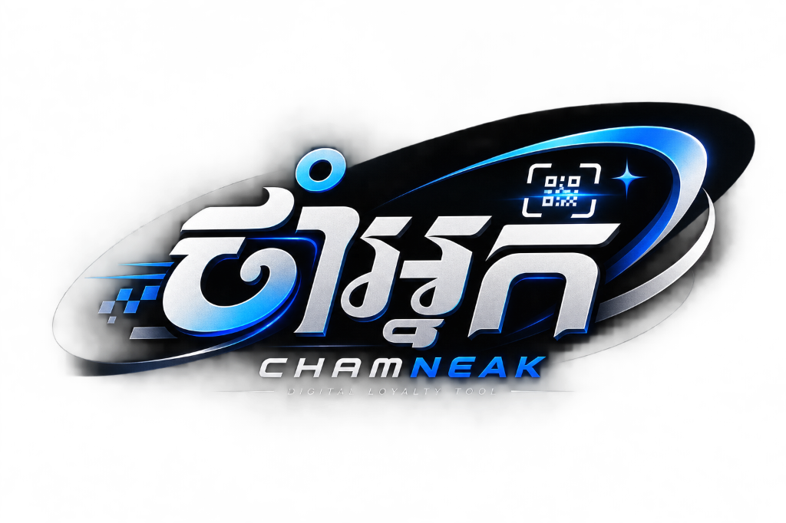
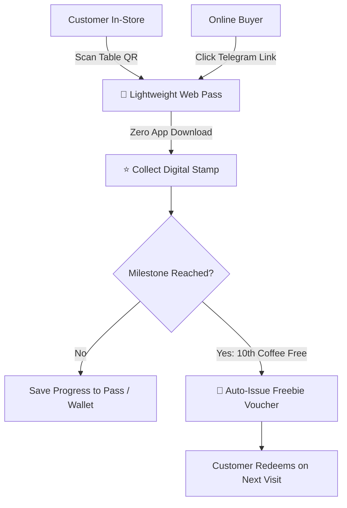

# ChamNeak (ចាំអ្នក) ☕🛍️

  

  

    <strong>Zero-Friction Digital Loyalty Tool for Cafes & Online Shops</strong>
  

  

    <a href="#about-the-name">About Name</a> •
    <a href="#the-problem">The Problem</a> •
    <a href="#key-features">Key Features</a> •
    <a href="#customer-flow">Customer Flow</a> •
    <a href="#architecture">Architecture</a> •
    <a href="#roadmap">Roadmap</a>
  

  

    
    
    
  

---

## 💡 About the Name

**ChamNeak (ចាំអ្នក)** is a Khmer phrase with a dual meaning:
* **"Waiting for you"** — Reflects warm Cambodian hospitality and welcoming customers back.
* **"Remembering you"** — Reflects the technology's core ability to automatically recognize and reward regular customers without paper cards.

---

## 🛑 The Problem

* **Paper Cards Get Lost:** Physical punch cards end up misplaced or forgotten at home.
* **App Fatigue:** Traditional loyalty apps require customers to download an app and create an account — 80%+ drop off immediately.
* **No Way to Re-engage Past Buyers:** Online shops (Telegram/Facebook/Instagram sellers) have no automated system to bring past customers back.
* **High Barrier to Entry:** Existing loyalty software is expensive ($30–$100+/mo) and requires complicated POS integrations.

---

## ⚡ How It Works (Customer Flow)

---

## 🎯 Project Objectives

### 1. General Objectives
- **Zero Friction:** Customers collect stamps without downloading apps or filling out long sign-up forms.
- **Fully Automated:** Tracks visits and auto-issues rewards without extra manual work for the owner.
- **Omnichannel:** One solution for both in-person cafes (via QR code) and online shops (via Messenger/Telegram/WhatsApp).
- **Ultra-Affordable:** Predictable flat rate (**$3–$5/month**) designed specifically for small and micro-businesses.
- **Actionable Insights:** Clean dashboard showing total customers, return rate, and top regulars.

---

## 🛠️ Architecture & Tech Approach

| Layer | Proposed Stack | Purpose |
| :--- | :--- | :--- |
| **Frontend** | Next.js / Tailwind CSS | Fast, lightweight PWA & mobile-first customer pass |
| **Backend / DB** | Supabase (PostgreSQL) / Firebase | Real-time stamp tracking & serverless auth |
| **Messaging Integration** | Telegram Bot API / Meta Graph API | Instant loyalty links & automated win-back notifications |
| **Hosting** | Cloudflare Pages / Vercel | Low-to-zero server overhead to keep subscription costs at $3–5/mo |

---

## 🗺️ Roadmap

- [x] **Phase 1: Concept & Identity**
  - [x] Define Problem & Objectives
  - [x] Brand naming & meaning (**ChamNeak / ចាំអ្នក**)
  - [x] Official visual branding & logo
- [ ] **Phase 2: MVP Core (Physical Cafes)**
  - [ ] Dynamic QR code generator for shop counters
  - [ ] Frictionless customer stamp web-app (Phone # / Device UUID / Passbook)
  - [ ] Owner dashboard for reward tier setup (e.g., "Buy 9, get 1 free")
- [ ] **Phase 3: Omnichannel & Chatbots**
  - [ ] Telegram & Messenger bot integration for online shops
  - [ ] Automated 30-day "Win-Back" campaign triggers
- [ ] **Phase 4: Apple / Google Wallet Passes**
  - [ ] One-click "Add to Apple Wallet / Google Wallet" digital punch cards
