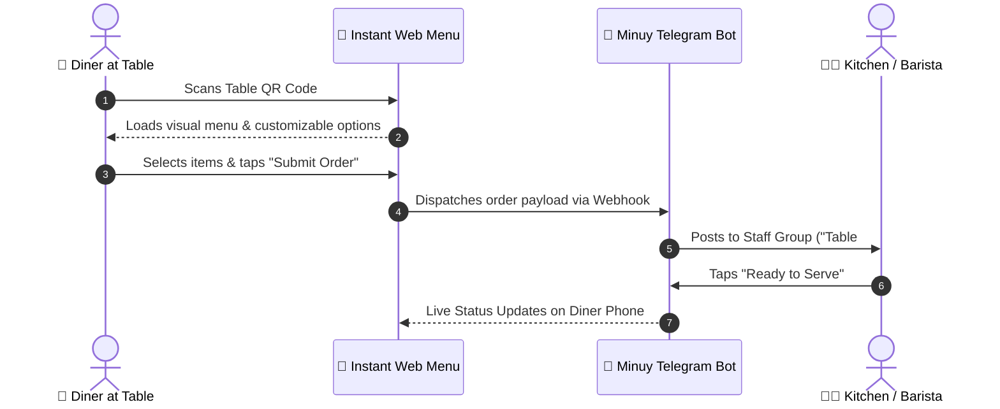

# Minuy (មីនុយ) 📜☕

  

  

    <strong>Instant QR Menu & Table Ordering System for Cafes & Eateries</strong>
  

  

    <a href="#about-the-name">About Name</a> •
    <a href="#the-problem">The Problem</a> •
    <a href="#key-features">Key Features</a> •
    <a href="#customer-flow">Customer Flow</a> •
    <a href="#architecture">Architecture</a> •
    <a href="#roadmap">Roadmap</a>
  

  

    
    
    
  

---

## 💡 About the Name
**Minuy (មីនុយ)** is the Khmer word for **"Menu"**. It is short, punchy, instantly recognizable to every local customer and business owner, and clearly states what the product delivers.

---

## 🛑 The Problem
1. **Expensive to Update:** Every price tweak or seasonal item requires costly reprinting of paper menus.
2. **Slow Table Service:** Waiters waste time running back and forth handing out menus, writing down notes, and delivering bills.
3. **No App Barrier:** Diners do not want to download an app just to view food items.

---

## ⚡ How It Works (Customer & Shop Flow)

---

## 🔑 Key Features
* **Real-time Menu Control:** Mark items as "Sold Out" or change prices in 2 taps from the owner's phone.
* **Instant Telegram Kitchen Notifications:** Orders post directly to the shop's staff Telegram group—no expensive receipt printers required (optional Bluetooth printer support available).
* **KHQR / Bakong Integration:** Customers can scan dynamic payment QR codes straight from their phone.

---

## 🛠️ Recommended Tech Stack
* **Frontend:** Next.js / Tailwind CSS (Ultra-fast mobile web experience)
* **Backend & DB:** Supabase (PostgreSQL + Realtime websocket updates)
* **Bot Integration:** Telegram Bot API
* **Hosting:** Vercel / Cloudflare Pages

---

## 🗺️ Roadmap
- [ ] **Phase 1:** QR Menu Generator with categorized item listings & photos
- [ ] **Phase 2:** Table-based ordering connected to a Telegram group webhook
- [ ] **Phase 3:** Dynamic KHQR (Bakong) checkout integration
- [ ] **Phase 4:** Daily sales summary sent to owner's Telegram at closing time
