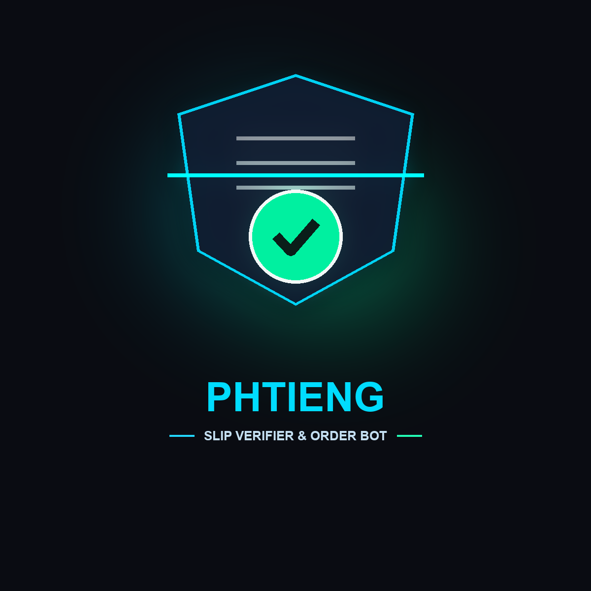
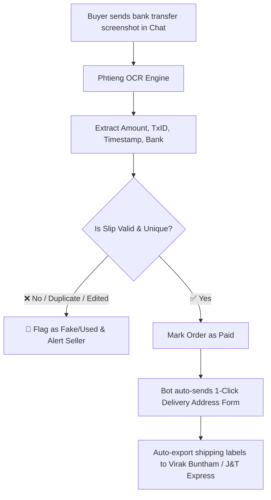

# Phtieng (ផ្ទៀង) ⚡📦

  

  <h3>Social Commerce Payment Slip Verifier & Auto-Order Bot</h3>
  
<strong>Stop fake payment slips. Automate order address collection for Live sellers.</strong>

  

    
    
    
  

---

## 💡 About the Name
**Phtieng (ផ្ទៀង)** means **"to verify, match, or double-check"** in Khmer. It accurately describes what the automated bot does: verifying payment slips against real transaction records to protect live sellers from scams.

---

## 🛑 The Problem
1. **Fake Slip Scams:** Fraudulent buyers Photoshop bank transfer screenshots (Bakong/ABA/Wing) to steal merchandise.
2. **Hours of Manual Checking:** Live sellers waste 3–4 hours every night matching bank notifications with chat screenshots.
3. **Lost Customer Addresses:** Shipping info gets buried in long chat threads, causing delivery errors.

---

## ⚡ How It Works (Verification Flow)

---

## 🔑 Key Features
* **Automated Slip Verification:** Validates amount, transaction ID, and timestamp instantly to block duplicates and fakes.
* **Smart Customer Form:** One-tap form to get precise phone number & delivery address.
* **1-Click Courier Export:** Exports clean shipping labels and spreadsheets directly formatted for delivery companies (J&T Express, Virak Buntham, Grab).

---

## 🛠️ Recommended Tech Stack
* **Bot Framework:** Telegraf (Node.js) / Grammy (TypeScript)
* **OCR & Image Parsing:** Google Cloud Vision / Tesseract / DeepSeek Vision
* **Database:** Supabase (PostgreSQL)
* **Hosting:** Cloudflare Workers / Fly.io
