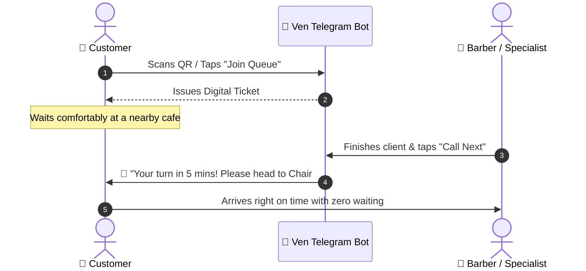

# Ven (វេន) ⏱️💈

  

  <h3>Smart Queue & Appointment Booking via Telegram</h3>
  
<strong>Eliminate crowded waiting areas. Give customers live queue updates.</strong>

  

    
    
    
  

---

## 💡 About the Name
**Ven (វេន)** means **"turn / shift / queue slot"** in Khmer. It is a sleek, 1-syllable modern name that represents organizing customers by their rightful turn smoothly.

---

## 🛑 The Problem
1. **Lost Walk-In Customers:** Customers leave if they see a crowded barbershop or salon with an unknown wait time.
2. **Messy Booking:** Booking appointments through chat messages leads to double-bookings and no-shows.

---

## ⚡ How It Works (Queue Flow)

---

## 🔑 Key Features
* Virtual Queue ticketing without app installation.
* Staff dashboard to call the next customer in 1 tap.
* Telegram reminder notifications to minimize no-shows.
