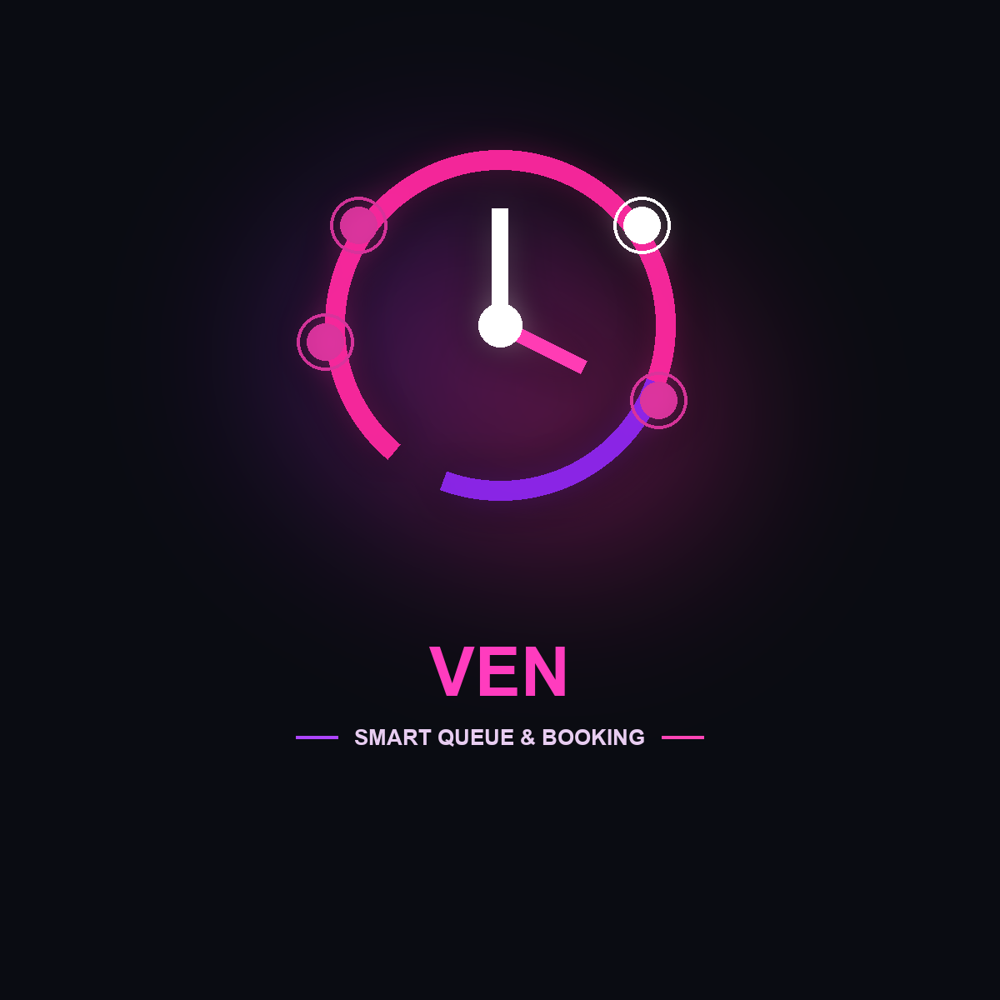

# 🎨 Micro-SaaS Projects - Brand & Logo Gallery

Here is the complete brand showcase and visual logos for all 5 projects in the directory.

---

### 1. ChamNeak (ចាំអ្នក) — *Digital Loyalty Tool*

  

* **Category:** Loyalty & Customer Retention
* **Touchpoint:** Counter QR / Instant Mobile Web Pass
* **Pricing:** $3–$5 / month
* **Documentation:** [View ChamNeak Docs](./01-chamneak/README.md)

---

### 2. Minuy (មីនុយ) — *QR Menu & Table Ordering*

  

* **Category:** Food & Beverage / Hospitality
* **Touchpoint:** Table QR Code / Telegram Bot
* **Pricing:** $5–$9 / month
* **Documentation:** [View Minuy Docs](./02-minuy/README.md)

---

### 3. Phtieng (ផ្ទៀង) — *Slip Verifier & Order Bot*

  

* **Category:** Social Commerce & Payment Verification
* **Touchpoint:** Telegram / Messenger Bot
* **Pricing:** $7–$12 / month
* **Documentation:** [View Phtieng Docs](./03-phtieng/README.md)

---

### 4. Ven (វេន) — *Smart Queue & Booking*

  

* **Category:** Barbershops, Salons & Clinics
* **Touchpoint:** Telegram Virtual Queue
* **Pricing:** $5–$8 / month
* **Documentation:** [View Ven Docs](./04-ven/README.md)

---

### 5. KitLuy (គិតលុយ) — *Mobile Invoicing & Revenue Tracker*

  

* **Category:** Freelancer & Small Business Invoicing
* **Touchpoint:** Mobile Web + Bakong KHQR
* **Pricing:** $3–$5 / month
* **Documentation:** [View KitLuy Docs](./05-kitluy/README.md)
